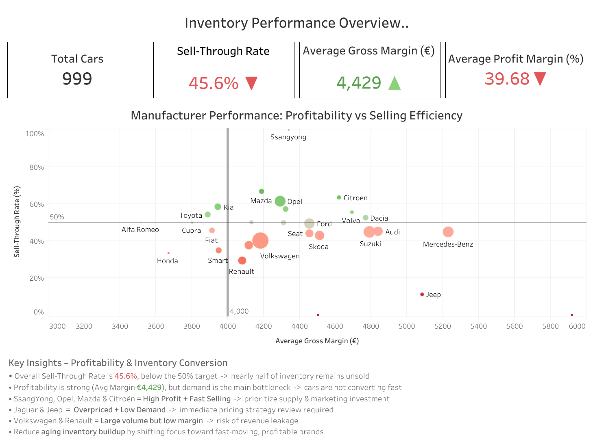

# Inventory Management Business Case

Analytics project for an online used-car marketplace (AUTO1-style inventory dataset).  
This project demonstrates an end-to-end analytics workflow: **Python → SQL (PostgreSQL) → Tableau**, including KPI engineering, dashboard design, and business recommendations.

---

## 📌 Project Overview

Starting from a single raw CSV file, this project:

- Cleans and analyzes the data in **Python (Google Colab)**
- Builds inventory-focused **KPIs using SQL + PostgreSQL**
- Creates clean exports for **Tableau dashboards**
- Provides **business insights** for pricing, supply, and inventory aging

This case study reflects real marketplace challenges: **unsold stock**, **slow-moving inventory**, **pricing gaps**, and **margin performance**.

---

## 🎯 Business Problem

Management wants to understand:

- Are we **selling inventory fast enough**?
- Which brands/models have **high aging and low demand**?
- Are cars **overpriced vs. the market**?
- Where should we **discount, promote, or scale supply**?

The goal is to support **data-driven pricing and purchasing decisions**.

---

## 📂 Dataset

A single car-level CSV file containing:

- Brand, model, fuel type, transmission
- Purchase price, listing price, gross margin
- Days online, sale flag, sale date
- Market reference price
- Mileage, model year, engine characteristics

Stored in:  
`data/raw/`

---

## 🛠 Tech Stack

- **Python (Colab)** – cleaning, feature engineering, insights  
- **PostgreSQL** – KPI calculations  
- **SQL** – aggregations & aging buckets  
- **Tableau Public** – dashboards & storytelling  
- **GitHub** – documentation & version control  

---

## 📁 Folder Structure

Inventory-business-case/  
│  
├── data/  
│   └── raw/  
│  
├── notebooks/  
│   └── auto1_inventory_case.ipynb  
│  
├── sql/  
│  
├── outputs/  
│   ├── car_level.csv  
│   └── kpi_agg.csv  
│  
├── tableau/  
│   ├── dashboard_1_inventory_overview.png  
│   └── dashboard_2_unsold_risk_overview.png  
│  
└── README.md  

---

## 🔍 Analysis Workflow

### **1. Python Exploration**
- Load raw CSV  
- Clean & transform  
- Create derived fields (`days_online`, sold flag, price gap)  
- Validate ranges & remove anomalies  

### **2. Feature Engineering & KPIs in SQL**
KPIs include:

- Sell-through rate  
- Average & median days online  
- Gross margin (€)  
- Profit margin %  
- Price gap vs market reference  
- Aging buckets (0–90, 90–180, 180–365, 365+ days)  

### **3. Export for Tableau**
- `car_level.csv` → one row per car  
- `kpi_agg.csv` → aggregated summaries  

### **4. Dashboard Design**
Two dashboards:

- **Executive view** → high-level KPIs, margin, sell-through  
- **Operational view** → unsold risk, aging, overpriced inventory  

---

## 📊 KPIs Used

- **Sell-through %**  
- **Average Days Online**  
- **Median Days Online**  
- **Average Gross Margin (€)**  
- **Profit Margin %**  
- **Price Gap (€, %)**  
- **Aging Distribution**  

---

## 📈 Tableau Dashboards

### **Dashboard 1 – Inventory Performance Overview**
🔗 https://public.tableau.com/views/Dashboard1_17619339694780/InventoryPerformanceOverview

**Answers:**

- How fast are vehicles selling?  
- Which brands/models contribute most to margin?  
- Where is capital locked in aging stock?  

---

### **Dashboard 2 – Unsold Inventory Risk Overview**
🔗 https://public.tableau.com/views/UnsoldInventoryRiskOverview/UnsoldInventoryRiskOverview

**Answers:**

- Which vehicles are overpriced?  
- Which brands have the highest aging risk?  
- Which inventory should be discounted or promoted?  

---

## 🧠 Key Insights Summary

- **Sell-through is below 50%** → significant capital lock-in  
- **54% of inventory remains unsold**, many > **346 days online**  
- Profit margins remain strong → **demand/aging** is the true issue  
- **Jeep & Jaguar** are overpriced → low sell-through  
- **Opel, Mazda, Citroën** → strong performers, scaling opportunity  
- **Volkswagen, BMW, Opel** → high contributors to aging stock  

---

## ▶️ How to Reproduce

### **Option 1 — Run in Google Colab**
Notebook:  
https://colab.research.google.com/drive/13dxooY4gMMSJdQsY81pg4cNt7IknnINj

Steps:

1. Open Colab  
2. Run all cells  
3. Export outputs (`car_level.csv`, `kpi_agg.csv`)  
4. Connect Tableau to the CSV files  

---

### **Option 2 — Run Locally**

Clone repository:

git clone https://github.com/Sajithpemarathna/Inventory-business-case.git  
cd Inventory-business-case  

(Optional) install dependencies:

pip install -r requirements.txt  

Open notebook and run all steps.

---

## 💼 What This Project Demonstrates

- Ability to turn vague business questions into KPIs  
- End-to-end workflow across **Python, SQL, Tableau**  
- Strong understanding of marketplace inventory economics  
- Ability to communicate insights clearly using dashboards and summaries  

---

## 🚀 Roadmap / Future Enhancements

- Add SQL automation to rebuild KPIs end-to-end  
- Add drill-downs in Tableau dashboards  
- Add forecasting models for inventory levels  
- Add discount simulation models  
- Add dashboard filter interactions  

---
